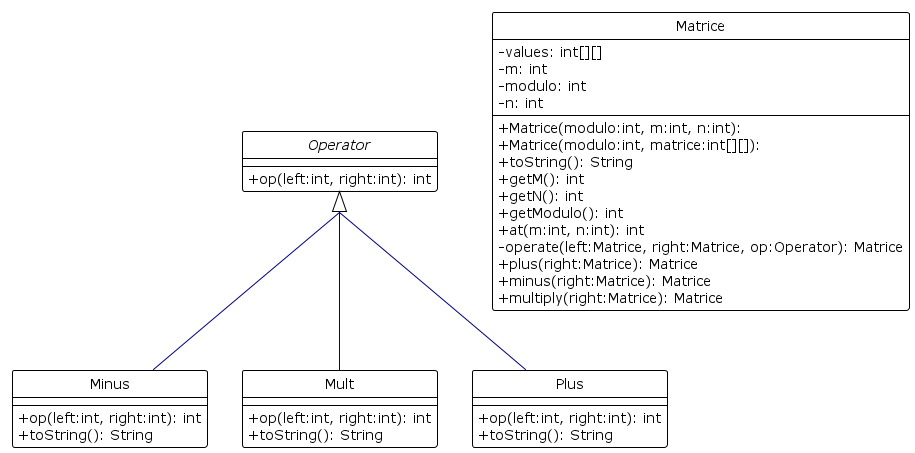

# Rapport Labo 5

Le laboratoire s'est articulé autour de deux classes principales :

- Matrice (classe contenant un tableau à deux dimensions
  représentant la matrice ainsi que la valeur modulo)
- Operator (classe abstraite)
    - Plus (addition)
    - Minus (soustraction)
    - Mult (multiplication)

La création des matrices se fait de deux manières. Soit de
manière aléatoire, soit en se basant sur un array existante à deux
dimensions. Dans le cas où une matrice existante ne serait pas
régulière, on la parcoure une première fois pour déterminer la largeur
N maximum, puis on la parcoure une seconde fois pour copier les
valeurs en les passant par le modulo. Si ces valeurs n'existent pas,
car dimension non régulière et inférieure à celle maximum, alors on
attribue 0 comme valeur.

Pour effectuer une opération, il faut passer par une méthode
d'une matrice ("plus", "minus" et "multiply"). Ces méthodes vont
ensuite
appeler la méthode privée "operate" de Matrice qui va effectuer
l'itération sur la matrice. Cette méthode prend en paramètre
l'opérateur correspondant à l'opération et appelle la méthode "op" de
celui-ci. "op" est une méthode abstraite de Operator qui doit être
redéfinie par chacun de ses héritiers. Cela permet d'effectuer une
opération mathématique simple en déléguant la manière d'itérer sur la
matrice à la classe Matrice elle-même. De cette manière il serait
trivial d'ajouter des nouvelles opérations, tel que demandé dans la
consigne du laboratoire. De plus, nous avons ajouté un opérateur
toString à Operator afin de pouvoir imprimer avec quel opérateur une
erreur se produit.
### Diagrame UML 

